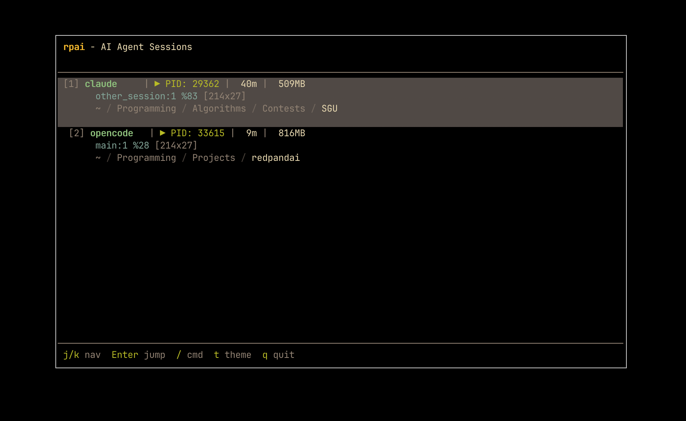

# rpai

<div align="center">
  
</div>

A tool for managing multiple AI coding agent sessions (opencode, claude, codex, cursor, gemini) in tmux.

<div align="center">
  
</div>

## Features

- Scan for running AI agent processes and ability to jump around.
- **Running/Waiting indicator** - shows if agent is active or stale (▶/⏸).
- Multiple color themes (gruvbox, nord, catppuccin, dracula, tokyo, solarized).
- Recommended workflow is to map to a tmux popup window.

## Installation

### Option 1: Install from crates.io (Recommended)

```bash
cargo install rpai
```

### Option 2: Install from source (Latest dev version)

```bash
git clone https://github.com/radoslav11/rpai.git
cd rpai
./install.sh
```

This builds and installs rpai in one step.

## Tmux Setup

Add this line to your `~/.tmux.conf` (or alternative mapping).

```bash
bind-key a display-popup -E "rpai"
```

Then reload tmux:

```bash
tmux source ~/.tmux.conf
```

**Now use it:**

- Press `prefix + a` to open rpai in a centered popup.

## Usage

```bash
rpai                # Interactive TUI (default)
rpai scan           # List sessions (non-interactive)
rpai jump <id|name> # Jump to session by ID or name
rpai kill <id>      # Terminate a session
rpai theme [name]   # Show/set theme
rpai help           # Show help
```

## Keyboard Shortcuts (TUI)

| Key | Action |
|-----|--------|
| `j` / `k` / `↑` / `↓` | Navigate sessions |
| `Enter` | Jump to selected session |
| `t` | Cycle through themes |
| `/` or `:` | Enter command mode |
| `q` / `Esc` / `Ctrl-C` | Quit |
| Mouse click | Select session |
| Mouse scroll | Navigate sessions |

## Commands (type after `/`)

- `theme [name]` - Switch theme (gruvbox, nord, catppuccin, dracula, tokyo, solarized)
- `themes` - List available themes

## Themes

- **gruvbox** (default) - Warm retro colors
- **nord** - Cool arctic blues
- **catppuccin** - Pastel mocha vibes
- **dracula** - Purple vampire aesthetic
- **tokyo** - Tokyo Night purple/blue
- **solarized** - Classic solarized dark

## Configuration

Config file: `~/.config/rpai/config.json`

**Example `config.json`:**

```json
{
  "theme": "gruvbox",
  "idle_threshold": 3.0,
  "refresh_ms": 50
}
```

To use ASCII symbols instead of Unicode (e.g., for terminals with poor Unicode support), set `"ascii_symbols": true`:

```json
{
  "theme": "gruvbox",
  "idle_threshold": 3.0,
  "refresh_ms": 50,
  "ascii_symbols": true
}
```

**Options:**
- `theme` - Color theme (default: `"gruvbox"`). Options: gruvbox, nord, catppuccin, dracula, tokyo, solarized.
- `idle_threshold` - CPU percentage threshold below which a process is considered idle/waiting (default: `3.0`). LSP servers (pyright, clangd, etc.) are automatically excluded from CPU calculation to avoid false positives from background indexing.
- `refresh_ms` - Refresh interval in milliseconds (default: `50`). Lower values give smoother updates but use slightly more CPU.
- `ascii_symbols` - Use ASCII symbols instead of Unicode (default: `false`). When `true`, shows `>>` for running and `||` for waiting instead of `▶` and `⏸`.

## License

MIT
